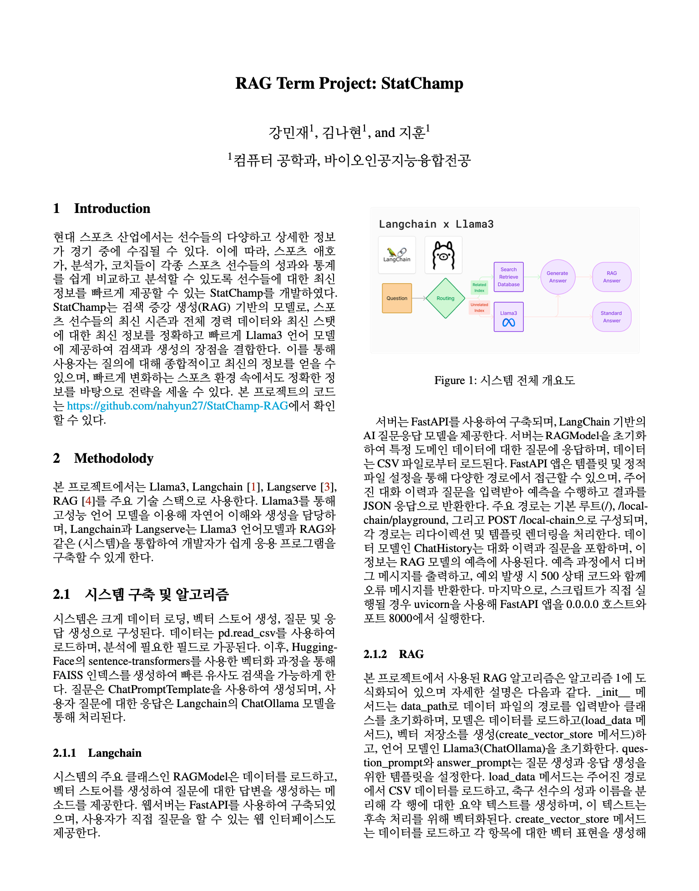
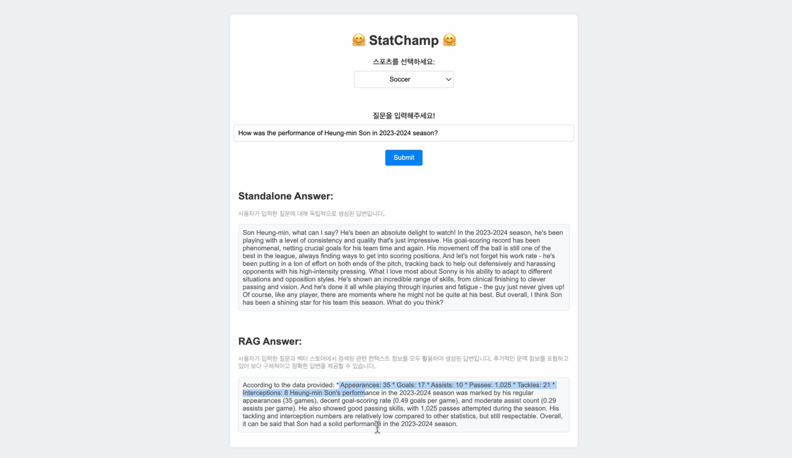

# StatChamp

StatChamp는 LangChain 라이브러리와 FastAPI를 사용하여 구축된 질문 응답 시스템입니다. RAG (Retrieval-Augmented Generation) 모델을 활용하여 사용자 질문에 대한 독립적인 답변과 문맥을 포함한 답변을 모두 제공합니다. 특히, 야구, 축구 등 스포츠 데이터를 추가로 제공하여 스포츠 관련 질문에 특화된 기능을 제공합니다.

## 주요 기능
- **독립적인 답변 생성**: 질문만을 기반으로 언어 모델이 생성한 답변을 제공합니다.
- **문맥 기반 답변 생성**: 질문과 관련된 문맥 정보를 포함하여 더 정확한 답변을 제공합니다.
- **FastAPI 웹 인터페이스**: 사용자가 질문을 입력하고 응답을 받을 수 있는 웹 인터페이스를 제공합니다.
- **Vector Store 기반 검색**: 유사한 문서를 검색하여 문맥 정보를 제공합니다.

## 추가 문서

### 프로젝트 보고서

프로젝트의 자세한 설명과 기술적인 내용을 다룬 보고서는 아래 링크에서 확인할 수 있습니다:

[](./docs/report.pdf)
[프로젝트 보고서 다운로드](./docs/report.pdf)

### 프로토타입 이미지

프로토타입 이미지의 전체 크기 이미지를 보려면 아래 이미지를 클릭하세요:

[](./docs/prototype_image.png)

### 발표 자료

발표 자료는 아래 링크를 통해 다운로드할 수 있습니다:

[](./docs/presentation.pptx)
[발표 자료 다운로드](./docs/presentation.pptx)


## 설치 및 실행 방법

### LangChain CLI 설치

LangChain CLI가 아직 설치되지 않았다면, 다음 명령어로 설치합니다:

```bash
pip install -U langchain-cli
```

## 패키지 추가

```bash
# adding packages from 
# https://github.com/langchain-ai/langchain/tree/master/templates
langchain app add $PROJECT_NAME

# adding custom GitHub repo packages
langchain app add --repo $OWNER/$REPO
# or with whole git string (supports other git providers):
# langchain app add git+https://github.com/hwchase17/chain-of-verification

# with a custom api mount point (defaults to `/{package_name}`)
langchain app add $PROJECT_NAME --api_path=/my/custom/path/rag
```

Note: you remove packages by their api path

```bash
langchain app remove my/custom/path/rag
```

## LangServe 실행

```bash
langchain serve
```

## Docker로 실행

이 프로젝트 폴더에는 LangServe 앱을 쉽게 빌드하고 호스팅할 수 있는 Dockerfile이 포함되어 있습니다.

### 이미지 빌드

이미지를 빌드하려면 다음 명령어를 사용하세요:

```shell
docker build . -t my-langserve-app
```

If you tag your image with something other than `my-langserve-app`,
note it for use in the next step.

### 로컬에서 이미지 실행

이미지를 실행하려면 애플리케이션에 필요한 환경 변수를 포함해야 합니다.

In the below example, we inject the `OPENAI_API_KEY` environment
variable with the value set in my local environment
(`$OPENAI_API_KEY`)

We also expose port 8080 with the `-p 8080:8080` option.

```shell
docker run -e OPENAI_API_KEY=$OPENAI_API_KEY -p 8080:8080 my-langserve-app
```


## 프로젝트 디렉토리 구조
```shell
/my-demo
    /app
        /static
            - styles.css
        /templates
            - playground.html
        - __init__.py
        - RAG.py
        - server.py
    /data
        - stats.csv
    /packages
        /extraction-openai-functions
        /vertexai-chuck-norris
    /docs
        - report.pdf             # 프로젝트 보고서 파일
        - prototype_image.png    # 프로토타입 이미지 파일
        - presentation.pdf      # 발표 자료 파일
    - .gitignore
    - Dockerfile
    - langserve.yaml
    - pyproject.toml
    - README.md
```
